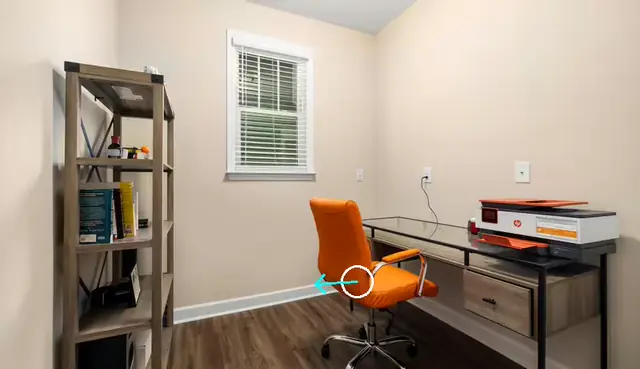
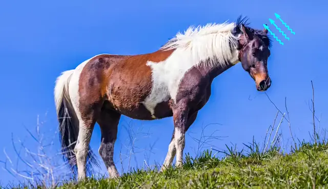
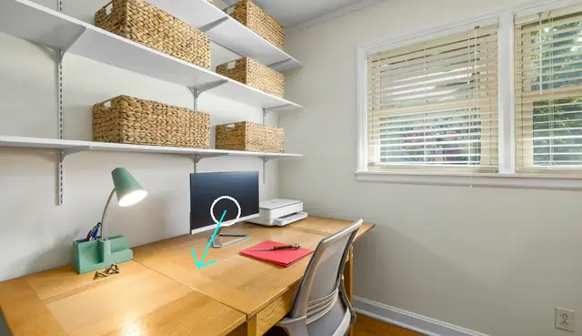

<div align="center">

# StreamForce

### Streaming Video Generation with Streaming Force Control

[Hanhui Wang](https://sarihust.github.io)<sup>1</sup> &nbsp;·&nbsp;
[Yiming Xie](https://ymingxie.github.io)<sup>1,2</sup> &nbsp;·&nbsp;
[Haiwen Feng](https://havenfeng.github.io)<sup>2,3</sup> &nbsp;·&nbsp;
[Zhaoyang Lv](https://lvzhaoyang.github.io)<sup>2</sup> &nbsp;·&nbsp;
[Shenlong Wang](https://shenlong.web.illinois.edu)<sup>4</sup> &nbsp;·&nbsp;
[Huaizu Jiang](https://jianghz.me)<sup>1</sup>

<sup>1</sup>Northeastern University &nbsp;&nbsp; <sup>2</sup>Impossible Research &nbsp;&nbsp;
<sup>3</sup>UC Berkeley &nbsp;&nbsp; <sup>4</sup>UIUC

**[📄 Paper](https://arxiv.org/abs/2606.07508)** &nbsp;·&nbsp;
**[🌐 Project Page](https://neu-vi.github.io/StreamForce/)** &nbsp;·&nbsp;
**[💾 Weights](https://drive.google.com/file/d/1ZaOEVMzOxAtcadX2c8hBF6wA7BrtUTOi/view?usp=sharing)**

<table>
<tr>
<td colspan="2" align="center"><b>Local force</b></td>
<td colspan="2" align="center"><b>Global force</b></td>
</tr>
<tr>
<td></td>
<td></td>
<td></td>
<td></td>
</tr>
<tr>
<td></td>
<td></td>
<td></td>
<td></td>
</tr>
</table>

</div>

---

Generate video from a single image while **continuously applying and modifying physical forces**
— push an object mid-clip, reverse the wind, and watch the video respond a fraction of a second
later.

Prior work trains a separate model per force type, assumes the force is fixed, or relies on
non-causal processing. StreamForce is a single **causal** model that handles both **local**
(point) and **global** (wind) forces, **time-varying**, in one unified force representation.

**Contents** — [Requirements](#requirements) · [Quick start](#quick-start) ·
[Interactive demo](#the-interactive-demo) · [Offline inference](#offline-inference) ·
[Training](#training) · [Limitations](#limitations) · [Roadmap](#roadmap)

---

## Requirements

Python 3.10 · CUDA 12.8 · a Hopper-class GPU (H100/H200) for the fast paths — the code detects
FlashAttention 3 and `channels_last_3d` support at import and falls back automatically on older
cards, more slowly.

**VRAM** — generator ~28 GB, VAE 2–13 GB, optional captioner ~18 GB; roughly 40 GB for the demo
on one GPU without captioning. Training is multi-GPU FSDP and assumes 8 GPUs.

`flash_attn_interface` (FlashAttention 3) and `sageattention` are optional and auto-detected.

---

## Quick start

```bash
# 1. environment
conda create -n streamforce python=3.10 && conda activate streamforce
pip install -r requirements.txt --extra-index-url https://download.pytorch.org/whl/cu128
pip install flash-attn==2.8.3 --no-build-isolation      # builds against the torch above

# 2. base model (~33 GB) -- resolved by path, so the layout matters
hf download Wan-AI/Wan2.2-TI2V-5B --local-dir wan_models/Wan2.2-TI2V-5B

# 3. download checkpoint
pip install gdown && mkdir -p checkpoints
gdown 1ZaOEVMzOxAtcadX2c8hBF6wA7BrtUTOi -O checkpoints/streamforce_v1_ckpt.pt

# 4. interactive demo
CUDA_VISIBLE_DEVICES=0,1 CHECKPOINT=checkpoints/streamforce_v1_ckpt.pt PORT=4023 ./demo/run.sh
```

Open `http://localhost:4023` — or forward it first if the box is remote:
`ssh -L 4023:localhost:4023 <host>`.

Run every script from the repository root; config and weight paths resolve relative to the
working directory. See [`wan_models/README.md`](wan_models/README.md) for the expected weight
tree.

Step 3 is one `.pt` that covers **both** point and wind forces, and it is all the demo and the
two causal inference scripts need — grab it from
[Google Drive](https://drive.google.com/file/d/1ZaOEVMzOxAtcadX2c8hBF6wA7BrtUTOi/view?usp=sharing)
in the browser instead if you prefer, and put it anywhere. Every script takes the path on the
command line (`--checkpoint_path`, or `CHECKPOINT=` for the demo); `--use_ema` loads the EMA
weights rather than the raw ones.

---

## The interactive demo

Upload an image or pick a gallery preset, drag on the canvas to aim a force, press **Start**.
Frames stream into the page as they are generated. **Drag again at any time** and the force
changes mid-clip.

<table>
<tr><td width="50%">

**Force modes**
- **Wind** — a global field, drag to aim
- **Point** — a localised push, click to place then drag

**Resolution / length**
- 480 × 832 at 16 fps
- 501 frames (~31 s) by default, longer with rolling forcing

</td><td width="50%">

**Scales with what you have**
- **1 GPU** — everything shares it
- **2 GPUs** — the VAE decoder moves to the second automatically
- **3 GPUs** — `CAPTION_DEVICE=cuda:2` isolates the optional auto-captioner

`CAPTION_MODEL=""` turns captioning off.

</td></tr>
</table>

### Measured on this implementation (H200, 480×832)

| | generation | force change lands |
| :-- | :-- | :-- |
| one GPU | ~23 fps | |
| two GPUs | ~37 fps headless, ~28 in the browser | **~6 frames (0.4 s) ahead of what you are watching** |

Left unpaced, the generator races ahead of the viewer and a force change lands ~213 frames
(13 s) away — technically applied on time, but far past what is on screen.
[`demo/README.md`](demo/README.md) explains how that gap is closed without making playback
stutter. [`demo/OPTIMIZATIONS.md`](demo/OPTIMIZATIONS.md) documents the inference optimizations,
what each requires, and what each costs numerically.

> **Note:** bind externally with `DEMO_HOST=0.0.0.0`, **not** `HOST` — conda's compiler
> activation exports `HOST=x86_64-conda-linux-gnu`, which the web server then tries to resolve
> as a hostname and exits.

---

## Offline inference

All three scripts read the six sample cases in [`assets/samples/`](assets/samples/README.md) —
three point-force and three wind-force stills, the same ones the demo offers as gallery presets
— selected with `--force_type`. The `*_change` variants reverse the force halfway through the
clip. Adding your own case is a PNG plus a CSV row; the sample README gives the columns.

**The 4-step causal student** — one 81-frame clip per case, and what the released checkpoint is:

```bash
python inference_causal.py \
    --config_path configs/dmd_everything.yaml \
    --checkpoint_path checkpoints/streamforce_v1_ckpt.pt \
    --force_type wind_force \
    --output_folder outputs/student_wind
```

**Rolling forcing** — the same student past its training horizon, and the reference
implementation the demo is built on:

```bash
python inference_causal_rolling_forcing.py \
    --config_path configs/dmd_everything.yaml \
    --checkpoint_path checkpoints/streamforce_v1_ckpt.pt \
    --force_type point_force_change \
    --output_folder outputs/rolling_point_change
```

**The bidirectional teacher** — 50 denoising steps, accurate and slow; takes a teacher
checkpoint you trained yourself with stage 1 of [Training](#training):

```bash
python inference.py \
    --config_path configs/finetune_bidirectional_teacher.yaml \
    --checkpoint_path <PATH_TO_TEACHER_CKPT> \
    --force_type point_force \
    --output_folder outputs/teacher_point
```

`--force_type` is one of `point_force`, `wind_force`, `point_force_change`,
`wind_force_change`. Add `--no_arrow` to save the raw frames without the force overlay,
`--use_ema` to load EMA weights, and `--seed` to change the noise. Output is one mp4 per case,
named by its row in the CSV. All three shard across GPUs under `torchrun --nproc_per_node=N`.

The benchmark sets the paper reports on are not distributed here; these six cases are for
checking that a checkpoint runs, not for reproducing the numbers.

---

## Training

| Stage | Config | Command |
| :-- | :-- | :-- |
| **1** Bidirectional ControlNet teacher | `finetune_bidirectional_teacher.yaml` | `train.py` |
| **2** ODE trajectory pairs from the teacher | — | `ode_pairs/generate_ode_pairs.py` |
| **3** ODE initialisation of the student | `ode_everything.yaml` | `train.py` |
| **4** Distribution-matching distillation | `dmd_everything.yaml` | `train.py` |

Stages 1, 3 and 4 all go through `train.py`:

```bash
torchrun --nproc_per_node=8 train.py --config_path configs/<stage>.yaml
```

`configs/default_config.yaml` is merged underneath whichever config you pass. Checkpoints are
threaded through the config (`generator_ckpt`, `real_score_controlnet_model_ckpt_path`), not the
command line.

Stage 2 is different: it runs a *trained teacher* over the force datasets and dumps the
denoising trajectory of each sample as a `.pt` pair, which stage 3 then regresses onto. It
takes the teacher checkpoint on the command line, and one `--scenario` per data source:

```bash
torchrun --nproc_per_node=8 ode_pairs/generate_ode_pairs.py \
    --scenario point_diverse \
    --config_path configs/finetune_bidirectional_teacher.yaml \
    --checkpoint_path <PATH_TO_TEACHER_CKPT>
```

The eight scenarios are `{point,wind}_{,change_}{synthetic,diverse}`. Stage 3 wants all of
them, so this normally runs once per scenario; output lands in `force_ode/<scenario>/`, which
the stage-3 config's `*_force_data_path` keys then point at. See
[`ode_pairs/README.md`](ode_pairs/README.md).

Training also needs the force datasets, which the data-processing scripts build — those are
[not released yet](#roadmap).

---

## Limitations

- The student trains on 81-frame clips. Rolling forcing generates far beyond that, but quality
  drifts past roughly 2–3× the training horizon, and attention reads back only 84 latents — the
  tail of a long clip drifts from the input image regardless of the force.
- Force is a **conditioning signal**, not a physics solver: it steers motion, it does not
  simulate it.

---

## Roadmap

Released:

- [x] Model — the ControlNet branch, the causal student, and the Wan2.2 modifications they need
- [x] Training — all four stages, driven by `configs/` and `train.py`: the bidirectional
      teacher, ODE pair generation, ODE initialisation, and distribution-matching distillation
- [x] Offline inference — `inference.py` (teacher), `inference_causal.py` (student) and
      `inference_causal_rolling_forcing.py` (the rolling-window implementation the demo uses)
- [x] Interactive demo — the streaming browser demo, with the pacing and inference
      optimisations documented in [`demo/README.md`](demo/README.md) and
      [`demo/OPTIMIZATIONS.md`](demo/OPTIMIZATIONS.md)
- [x] Sample data — six cases in [`assets/samples/`](assets/samples/README.md) so the
      inference scripts run without any private dataset
- [x] **Distilled student weights** — the 4-step causal model, on
      [Google Drive](https://drive.google.com/file/d/1ZaOEVMzOxAtcadX2c8hBF6wA7BrtUTOi/view?usp=sharing)

Still to come:

- [ ] Data processing — the scripts that build the force datasets: rendering the synthetic
      point and wind clips, captioning and annotating the diverse real-image sets, and the
      train/val split tooling. The `datasets/` layout the training configs expect is produced
      by these
- [ ] Falling motion — a falling-specific teacher and the dual-teacher distillation recipe
      that routes supervision between it and the unified force teacher

Looking further out, we are exploring porting the force conditioning to a stronger video
backbone (MiniMax H3).

---

## Citation

```bibtex
@misc{wang2026streamingvideogenerationstreaming,
  title  = {Streaming Video Generation with Streaming Force Control},
  author = {Hanhui Wang and Yiming Xie and Haiwen Feng and Zhaoyang Lv and Shenlong Wang and Huaizu Jiang},
  year   = {2026},
  eprint = {2606.07508},
  archivePrefix = {arXiv},
  primaryClass  = {cs.CV},
  url    = {https://arxiv.org/abs/2606.07508}
}
```

---

## License and attribution

Released under the [Apache License 2.0](LICENSE).

`wan/` is derived from [Wan2.2](https://github.com/Wan-Video/Wan2.2) (Alibaba), also Apache-2.0;
the modifications made here are itemised in [NOTICE](NOTICE). The causal student, ODE
initialisation and distillation setup follow **CausVid** ([arXiv:2412.07772](https://arxiv.org/abs/2412.07772))
and **Self-Forcing**; the force-conditioning datasets follow the **Force Prompting** line of
work. Full details in [NOTICE](NOTICE).
